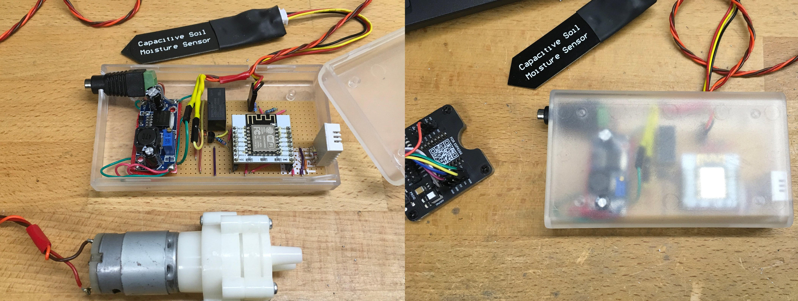
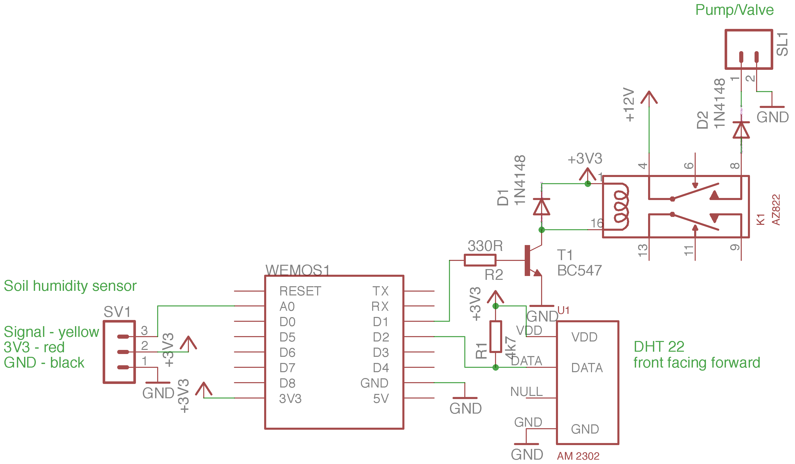
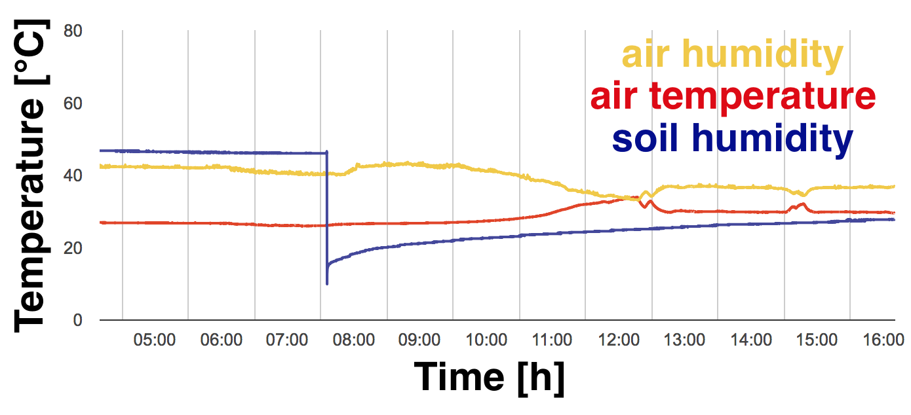

# flowers of things

Controller for watering your plants powered by an ESP8266. Controlls soil humidity with a capacitive soil moisture sensor and waters plants accordingly. Watering and soil humidity can be supervised in the browser.

<p align="center">
  
  </a>
</p>


Schematic setup:
<p align="center">
  
  </a>
</p>

How to run:

* Install Arduino IDE (in this case 1.8.5) and add [ESP8266FS](https://github.com/esp8266/arduino-esp8266fs-plugin) in the Arduino tools folder (create it if it does not exist: 'Arduino/tools/ESP8266FS/tool/esp8266fs.jar'). This way after a restart of the Arduino IDE "ESP8266 Sketch Data Upload" should show up in tools.
* Libraries needed for running 'flowers of things'.

```
#include <ESP8266WiFi.h>
#include <ESP8266WiFiMulti.h>
#include <WiFiUdp.h>
#include <ArduinoOTA.h>
#include <ESP8266WebServer.h>
#include <ESP8266mDNS.h>
#include <FS.h>
#include <pins_arduino.h>
```
* Provide SSID and password for internet connection (needed for timestamp) in the sketch. Don't forget to change the OTA password.
* Set parameters for watering in '/data/config.json'
	* 'humiditylimit' - humidity threshold triggering watering
	* 'waitingtime' - waiting time to next watering
	* 'waterduration' - watering time for one cycle
* Transfer files in data folder by pressing "ESP8266 Sketch Data Upload" in the tools menu. This can be tricky sometimes. If uploading fails try to unplug USB and start "ESP8266 Sketch Data Upload" immediately after you plug it in again.
* Compile and flash ESP, check serial monitor for IP address.
* Direct your browser to the IP address or choosen DNS (in this example http://esp8266.local) and see if the graph is working.
* Measurement parameters can also be extracted via HTTP GET (example in Debug):
  * soil humidity: curl --request GET --url http://YOUR-IP-or-DNS/soil
  * air temperature: curl --request GET --url http://YOUR-IP-or-DNS/temp
  * air humidity: curl --request GET --url http://YOUR-IP-or-DNS/hum

Exemplary plot:
<p align="center">
  
  </a>
</p>


Component list:

* [Europlatine Hartpapier	](https://www.conrad.de/de/tru-components-su527629-europlatine-hartpapier-l-x-b-90-mm-x-50-mm-35-m-rastermass-254-mm-inhalt-1-st-1570117.html)
* [Zettler Electronics AZ822-2C-3DSE Printrelais 3 V/DC 2 A 2 Wechsler 1 St.Artikelnr. 507428](https://www.conrad.de/de/zettler-electronics-az822-2c-3de-printrelais-3-vdc-2-a-2-wechsler-1-st-507422.html?altOf=AN)
* [Kapazitiver Analog Boden-Feuchtigkeitssensor Capacitive Soil Moisture Sensor	](https://www.ebay.de/itm/Kapazitiver-Analog-Boden-Feuchtigkeitssensor-Capacitive-Soil-Moisture-Sensor/122964137468)
* [12V Wasser Pumpe Wasserpumpe Trinkwasserpumpe Frischwasserpumpe	](https://www.ebay.de/itm/12V-Wasser-Pumpe-Wasserpumpe-Trinkwasserpumpe-Frischwasserpumpe-3V-5V-6V-8V-9V/131976810073)
* [Standarddiode Vishay 1N4148-TAP DO-204AH 75 V 300 mA Artikelnr. 564851	](https://www.conrad.de/de/standarddiode-vishay-1n4148-tap-do-204ah-75-v-300-ma-564851.html)
* [GS12E12-P1I :: Steckernetzteil, 12 W, 12 V, 1 A, stabilisiert	](https://www.reichelt.de/steckernetzteil-12-w-12-v-1-a-stabilisiert-gs12e12-p1i-p161600.html)
* [LM2596	](https://www.ebay.de/itm/3x-LM2596-DC-Step-Down-Spannungswandler-Arduino-Modul-Regler-LM2596S/252785167788)
* [DHT22	](https://www.exp-tech.de/sensoren/temperatur/7784/dht22-am2302-feuchtigkeits-und-temperatursensor)
* [12V Magnetventil	](https://www.ebay.de/itm/DC-12V-Normally-Closed-NC-Electric-Solenoid-Valve-Air-Gas-Water-Leak-Switch-ZP/123176051567)
* [WEMOS D1 Mini	](https://www.exp-tech.de/plattformen/esp8266/entwicklungsboards/8898/wemos-d1-mini)
* [Schlauch	](https://www.ebay.de/itm/Silikonschlauch-Meterware-Industriequalit%C3%A4t-60-C-bis-200-C-Schlauch-Transparent/111938385319)
* [Micro USB 2.0 Kabel, USB St. A / USB Micro St. B,	](https://www.exp-tech.de/zubehoer/kabel/usb/5296/micro-usb-2.0-kabel-usb-st.-a/usb-micro-st.-b-1-0m)
* [Delock Adapter DC 2,1 x 5,5 mm Buchse	](https://www.exp-tech.de/zubehoer/steckverbinder/7127/delock-adapter-dc-2-1-x-5-5-mm-buchse-terminalblock-2-pin)
* [Micro-Drip-System rohrhalter	](https://www.alternate.de/html/product/1213370?gclid=CjwKCAjwwo7cBRBwEiwAMEoXPK-mqA9fKown9JBEyRNXELA98nCeG9JYhJrR93G3WSYS-3KH7RXtkhoC0VsQAvD_BwE)
* [Nylon Y-Stück 3fach Schlauchtülle 6mm	](https://www.pvc-welt.de/Nylon-Y-Stueck-3fach-Schlauchtuelle_1)
* [Nylon Schlauchverbinder Reduzierung 6 x 4mm	](https://www.pvc-welt.de/Nylon-Schlauchverbinder-Reduzierung)
* [PVC Schlauch transparent 4/6mm Meterware	](https://www.pvc-welt.de/PVC-Schlauch-transparent-4-6mm_1)
* resistors (330 Ohm, 4.7 kOhm)
* [ESP8266 Test Board Burn Unterstützung ESP-12S/12F/12E/07S Module BAF](https://www.ebay.de/itm/ESP8266-Test-Board-Burn-Unterstutzung-ESP-12S-12F-12E-07S-Module-BAF/263445680019?hash=item3d56960f93:g:14oAAOSwIspaYRMV)

Alternative components:

* [PMIC - Spannungsregler - Linear (LDO) Microchip Technology MCP1700-3302E/TO Positiv, Fest TO-92-3	](https://www.conrad.de/de/pmic-spannungsregler-linear-ldo-microchip-technology-mcp1700-3302eto-positiv-fest-to-92-3-651408.html)
* [Teapo SY 100uF/35V 6,3x11mm Elektrolyt-Kondensator radial bedrahtet 2.5 mm 100 µF 35 V 20 % (Ø x L) 6.3 mm x 11 mm 1 St	](https://www.conrad.de/de/teapo-sy-100uf35v-63x11mm-elektrolyt-kondensator-radial-bedrahtet-25-mm-100-f-35-v-20-o-x-l-63-mm-x-11-mm-1-st-443974.html)
* [Esp8266 Esp-12e Wireless Remote Serial Wifi Transceiver Board Modul Ap	](https://www.ebay.de/itm/NEW-ESP8266-ESP-12F-Serial-WIFI-Kabellos-Transceiver-LWIP-AP-STA-BAF/263409564458)
* [USB ESP8266 ESP01 Seriell Adapter Programmierer ESP 01 UART Arduino	](https://www.ebay.de/itm/USB-ESP8266-ESP01-Seriell-Adapter-Programmierer-ESP-01-UART-Arduino/253295759295)
* [5PCS ESP8266 Mount	](https://www.ebay.de/itm/5PCS-ESP8266-Serial-WIFI-Module-Adapter-Plate-ESP-08-ESP-07-ESP-12-BAF/263413680345)
* [ESP8266 Developerboard	](https://www.ebay.de/itm/NodeMCU-V3-1-Arduino-ESP8266-ESP-12-E-Lua-CH340-WiFI-WLan-IoT-Lolin-Mini-Micro/252718027546)


References:

* sketch adapted from <https://github.com/tttapa/ESP8266>
* many thanks to the very helpul guys from [FabLab Neckar-Alb e.V.](https://www.fablab-neckar-alb.org/)  

Icons used for favicon:

* Plant by rivercon from the Noun Project
* drop by Creative Stall from the Noun Project

ToDo:

* save input boxes for wrong input/make more userfriendly
* interactive plots (Zoom, Ajax, websocket etc.)
* MQTT/NiFi
* password from web useage without VPN
* initialize sensor before measurement so its not always on
* horizontal and vertical lines in plots to mark thresholds and watering time
* only keep the last X days in memory instead of deleting when file is too big
* water height sensor for tank
* BME280
* write about OTA
